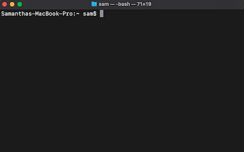
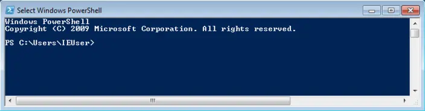
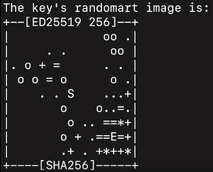

# Lesson 1.1: START HERE

Welcome to the Grab a Byte Lunchtime Learning Series! This semester we are learning GitHub!

---

## Table of Contents
- Sign-up for GitHub
- Git v. GitHub
- Terminal/Powershell
  - Terminal (Mac)
  - Powershell (Windows) 
- Installing Git on Windows
- Installing Git on Mac
- Set Up Git Config
- Authenticate GitHub
- The Grab a Byte Repo
- Forking
- Cloning
- OPTIONAL: Homework
- Next Up

---

## Sign-up for GitHub

Use this link: [GitHub Sign-Up](https://github.com/signup)

**TIPS**
- Use your school email address (students can get a free PRO account! <- more details in the homework below)
- Use a professional username. Future employers might be checking our your profile!

**NOTE** 
You are going to need your screen name and email address a little later so make sure you write down/remember it!

---

## Git v. GitHub

**Git** - is a free, open-source version control system that tracks changes in computer files.

**GitHub** - is a hosting service that provides cloud-based platform to store Git Repositories.

**Repository or Repo** - is an individual project. Repos contain all of your code, files, and each file's revision history. 

---

## Terminal/Powershell
The **Terminal**(Mac) or **Powershell**(Windows) is a text-based interface that allows users to interact with their computers operating system by typing commands. 

You may already recognize them! 




### Terminal (Mac)
Click on "Launch Pad" and in the search bar at the top of the screen type in "Terminal". Click the Terminal app:


### Powershell (Windows)
Click the "Start" Button, type "PowerShell". Select "Windows PowerShell" from the search results. Click Open.

--- 

## Installing Git on Windows
1. Go to [Git Homepage](https://git-scm.com/downloads/win) and download Git.
2. After it's downloaded, open the file
3. Install, leaving all the default options as is (If you want, when it gets to the section about "choosing the default editor used by Git" you can switch it from Vim to something like VS Code)
4. Launch Git Bash
5. Run the command "```git --version```"
6. It should return something like "```git version x.x.x```"


You can always get back to Git Bash after you close out of it by clicking the "Start" button, typing "Git Bash" and clicking on the Git Bash application. 

**NOTE**: You can use Git Bash instead of Powershell! 

---

## Installing Git on Mac

Most Macs these days come with Git pre-installed. 

1. Open the terminal app
2. Type the command: "```git --version```"
3. You should see something like "```git version x.xx.x```" (If your version is 2.39 or over, then you are good to go, if not, please continue with the rest of the steps)
4. Go to the [Install Homebrew](https://brew.sh/) website and copy and paste the install command from the website to your terminal (the command looks like this: "```/bin/bash -c "$(curl -fsSL https://raw.githubusercontent.com/Homebrew/install/HEAD/install.sh)"```) <- you may need to enter your computer password or computer login pin.
5. Press return when prompted to go through the install process, it should only take a few seconds. It might also ask you to install xcode command line if it isn't already installed, go ahead and follow those installation instructions as well.
6. If you see a "Next steps:" section at the bottom that says to run commands, copy and paste those commands and run them. 
7. You should then be able to run the command "```brew --version```" and see something like "```Homebrew x.x.x```"
8. Next type the command "```brew install git```", it should take about a minute to install.
9. You can then check your git version again using the "```git --version```" command. 

---

## Set Up Git Config

To use Git effectively, you need to configure it properly using the git config command. This setup ensures that Git recognizes your identity, settings, and workflow preferences.

1. Set global username with the command ```git config --global user.name 'username'``` <- make sure this is your github username that you registered with earlier
2. Set global email with the command ```git config --global user.email 'user email'``` <- make sure this is your github email address that you registered with earlier
3. Set the default branch to 'main' instead of 'master' with the command ```git config --global init.defaultBranch main``` <- main is the new norm, master is outdated and inappropriate.

---

## Authenticate Github

You can access repositories on Github from the command line (Terminal/Powershell/Bash) in two ways. HTTPS(Hypertext Transfer Protocol Secure) and SSH(Secure Shell). We will be using SSH, because it is more secure and efficient. 

1. Make sure you have SSH installed on your computer. In your Terminal/Powershell/Bash, type the command "```ssh -V```" <- notice the capital V!
2. **(WINDOWS)** If you don't see "```OpenSSH_x.xxx, LibreSSL x.x.x``` or something similar you will need to install it by going to Settings > System > Optional Features. Select "Add a feature" and search fro OpenSSH Client, then select install. **(MAC)** You should see it. It's already installed on all Macs. 
3. Next we'll generate a key pair by using the command: "```ssh-keygen -t ed25519 -C user.name```" <- use the same user.name as your GitHub.
4. Your command line should say it's generating a key pair. Then it will ask you to enter the file in which to save the key, and in then it will show the default path and file name in parenthesis. You can copy and paste this or type in what it says but change the "```id_ed25519```" to something more memorable like "```keygen_github```" or something like that. Whatever file name you use, write it down, because you will need it in a few steps
5. It will ask you to enter a passphrase. If you share this computer, you should consider a passphrase you'll remember. Or you can just press enter, to skip through the passphrase and not add one.
6. The key will generate and look like an ASCII art image. Like this:



7. Next you will need to enter this command: "```eval "$(ssh-agent -s)"```"
8. Next you need to type in the command: "```pbcopy < ~/.ssh/```enter the name of the file you used earlier (example "keygen_github")```.pub```
9.  Now you'll need to log in to GitHub, click on your profile icon in the top right corner, from the drop down, go to "Settings". In the second section of the left menu (called "Access") in the middle is "SSH and GPG keys" Click that menu item.
10. Click the green button that says "New SSH Key"
11. You can name it whatever you like in the Title box. (ex. Work Laptop, Personal Laptop, etc.)
12. Key type is "Authentication Key"
13. In the Key box, you can paste by right clicking and choosing "Paste", or pressing Ctrl V on Windows or Command V on Mac.  <- if you did anything between step 9 and this step that caused you to copy something else, go to your terminal, redo step 8 and then jump back to this step and do it again to paste the key, which should look like a long jumble of random letters and numbers
14. Click "Add SSH Key" green button
15. It will ask you to confirm by entering your GitHub password
16. Verify the key by going back to your command line and typing the command "```ssh -T git@github.com```"
17. You should see a message that says: "```Hi user.name! You've successfully authenticated, but GitHub does not provide shell access.```" <- This is good! 


Now, anytime you want to make a change to a repo on GitHub, instead of logging in each time, it should verity the key pair on your computer without needing to prompt you. 

**NOTE** If you added a passphrase in step 5, you'll only be asked to enter it once per session. 

---

## The Grab a Byte Repo

This Repo! 

Just a few notes before we continue. This Repo should be seen as a workbook! There are going to be many times over the next 10 weeks of lessons that asks you to edit, make changes, add things, etc. 

This is your place to test out and try new things and get comfortable with GitHub!

Last semester's presentations and code are in the folder 00 - Past Workshops/Algorithms - Spring 2025

So, lets make you your own copy of this workbook!

---

## Forking
*coming soon*

---

## Cloning
*coming soon*

---

## OPTIONAL: Homework
*coming soon*

---

## Next Up
*coming soon*