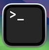

# Lesson 1.1: START HERE

Welcome to the Grab a Byte Lunchtime Learning Series! This semester we are learning GitHub!

---

## Table of Contents
- Sign-up for GitHub
- Git v. GitHub
- Terminal/Powershell
  - Terminal (Mac)
  - Powershell (Windows) 
- Installing Git on Windows
- Installing Git on Mac
- Set Up Git Config
- The Grab a Byte Repo
- Forking
- Cloning
- OPTIONAL: Homework
- Next Up

---

## Sign-up for GitHub

Use this link: [title](https://github.com/signup)

**TIPS**
- Use your school email address (students can get a free PRO account! <- more details in the homework below>)
- Use a professional username. Future employers might be checking our your profile!

---

## Git v. GitHub

**Git** - is a free, open-source version control system that tracks changes in computer files.

**GitHub** - is a hosting service that provides cloud-based platform to store Git Repositories.

**Repository or Repo** - is an individual project. Repos contain all of your code, files, and each file's revision history. 

---

## Terminal/Powershell
The **Terminal**(Mac) or **Powershell**(Windows) is a text-based interface that allows users to interact with their computers operating system by typing commands. 

You may already recognize them! 


### Terminal (Mac)
Click on "Launch Pad" and in the search bar at the top of the screen type in "Terminal". Click the Terminal app:



### Powershell (Windows)
Click the "Start" Button, type "PowerShell". Select "Windows PowerShell" from the search results. Click Open.

--- 

## Installing Git on Windows
1. Go to [Git Homepage](https://git-scm.com/downloads/win) and download Git.
2. After it's downloaded, open the file
3. Install, leaving all the default options (If you want, when it gets to the second about "choosing the default editor used by Git" you can switch it from Vim to something like VS Code)
4. Launch Git Bash
5. Run the command "```git -- version```"
6. It should return something like "```git version x.x.x```"


You can always get back to Git Bash after you close out of it by clicking the "Start" button, typing "Git Bash" and clicking on the Git Bash application. 

**NOTE**: You can use Git Bash instead of Powershell! 

---

## Installing Git on Mac
*coming soon*

---

## Set Up Git Config
*coming soon*

---

## The Grab a Byte Repo
*coming soon*

---

## Forking
*coming soon*

---

## Cloning
*coming soon*

---

## OPTIONAL: Homework
*coming soon*

---

## Next Up
*coming soon*