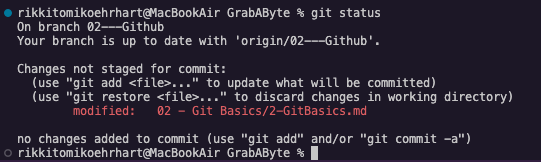
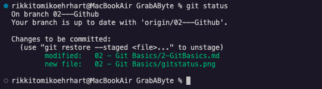
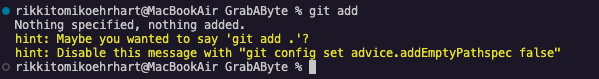

# Lesson 2.1: Git Basics 

Welcome to the Grab a Byte Lunchtime Learning Series! This semester we are learning GitHub!

Last week we signed up for GitHub and set it up on our machines! This week we are going over some GitHub Basics

---

## Table of Contents

- The README File
  - For Example: The Grab A Byte README
- Common Git Commands
  - Status
  - Add
  - Commit
  - Push
- Messages Matter
- Lets Do It Together!
- OPTIONAL: Homework
- Next Up!


---

## The README File

The README file serves as the first point of contact for users and developers who want to understand the purpose, setup, and usage of a project.

In a GitHub Repo, the README.md file is displayed on the main page of the repo. 

The .md at the end of the README.md stands for "markdown" which is a very simple and easy formatting language that we will use throughout this course. 


Programmers can use the README file to:
- Introduce their project
- Show screenshots of their program
- Explain how viewers can run the code for themselves
- List what technologies they used 
- Explain how other programmers can contribute to their project
- Contact Details
- and so much more!

### For Example: The Grab A Byte README

In the README.md for this project (which is located in the main folder and is displayed in the repo's main page, see screenshot below)

[screenshot]

We've included our logo image, a welcome paragraph explaining what Grab a Byte is and what we are learning this semester, and a table of the workshop dates. 

---

## Common Git Commands
In today's lesson we are going to go over 4 common git commands: status, add, commit, and push.

Lets discuss each of them. 

### Status
The ```git status``` command displays the state of the working directory and the staging area. Think of the staging area as a place to keep track of the current files you are working on. When you are ready to save them to Git, Git will use what is in your staging area.

You would use the ```git status``` command to check what files have been modified but not added to the staging area. 



The red line here shows that this file has been modified, but I haven't added it to the staging area. 

When you add items to the staging area they turn green the next time you use the ```git status``` command:



### Add
The ```git add``` command adds a changed/new file from the working direction to the staging area. It tells Git that you want to include these updates. 

However, ```git add``` doesn't really affect the repository in any significant way, changes are not actually recorded at this point. You are just telling git that you want to include these changes the next time you push your changes to Git/GitHub.

If you try to use the command ```git add``` by itself, just like that, you will receive an error:



This is because you need to add something after add. To add a single file you can write ```git add file.extension``` so if I wanted to add the README.md file I would use the command ```git add README.md```. 

If I wanted to add all the files that have been modified in this session I could use the command ```git add -A``` or ```git add .```, there are about two dozen other add extensions I can use for various reason. You can learn more about them [here](https://git-scm.com/docs/git-add) if you are interested.

Throughout this course, we will use ```git add filename.extension``` and ```git add .```


### Commit
The ```git commit``` command creates a **commit**, which is like a snapshot of your repo at specific times.

You should make commits often, based around logical units of change. Over time, commits should tell a story of the history of your repo and how it came to be the way that it currently is. 

Commits include lots of metadata in addition to the contents and a ***message*** written by the author (you).

Think of Commits like the save points in a game. Each time you do something significant like solve a puzzle or defeat an enemy, you save the game. The same goes for commits. 

Each time you do something significant, for example after:
- Adding a loop
- Adding a class or function
- Changing a loop, class, or function
- Fixing a bug
  
Tips for committing:
- Commit often
- Commit in small chunks
- Don't commit half-done work
- Test your code before you commit
- Write good messages (which we will talk about more in depth in the "Messages Matter" section below)


### Push


---

## Messages Matter
*coming soon*

---

## Lets Do it Together!
*coming soon*

---

## OPTIONAL: Homework
*coming soon*

---

## Next Up!
*coming soon*