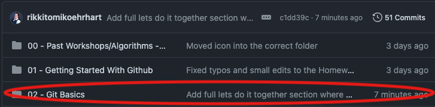

# Lesson 2.1: Git Basics 

Welcome to the Grab a Byte Lunchtime Learning Series! This semester we are learning GitHub!

Last week we signed up for GitHub and set it up on our machines! This week we are going over some GitHub Basics

---

## Table of Contents

- The README File
  - For Example: The Grab A Byte README
- Common Git Commands
  - Status
  - Add
  - Commit
  - Push
  - How They Work Together
- Messages Matter
- Lets Do It Together!
- OPTIONAL: Homework
- Next Up!


---

## The README File

The README file serves as the first point of contact for users and developers who want to understand the purpose, setup, and usage of a project.

In a GitHub Repo, the README.md file is displayed on the main page of the repo. 

The .md at the end of the README.md stands for "markdown" which is a very simple and easy formatting language that we will use throughout this course. 


Programmers can use the README file to:
- Introduce their project
- Show screenshots of their program
- Explain how viewers can run the code for themselves
- List what technologies they used 
- Explain how other programmers can contribute to their project
- Contact Details
- and so much more!

### For Example: The Grab A Byte README

In the README.md for this project (which is located in the main folder and is displayed in the repo's main page, see screenshot below)

[screenshot]

We've included our logo image, a welcome paragraph explaining what Grab a Byte is and what we are learning this semester, and a table of the workshop dates. 

---

## Common Git Commands
In today's lesson we are going to go over 4 common git commands: status, add, commit, and push.

Lets discuss each of them. 

### Status
The ```git status``` command displays the state of the working directory and the staging area. Think of the staging area as a place to keep track of the current files you are working on. When you are ready to save them to Git, Git will use what is in your staging area.

You would use the ```git status``` command to check what files have been modified but not added to the staging area. 


The red line here shows that this file has been modified, but I haven't added it to the staging area. 

When you add items to the staging area they turn green the next time you use the ```git status``` command:


### Add
The ```git add``` command adds a changed/new file from the working direction to the staging area. It tells Git that you want to include these updates. 

However, ```git add``` doesn't really affect the repository in any significant way, changes are not actually recorded at this point. You are just telling git that you want to include these changes the next time you push your changes to Git/GitHub.

If you try to use the command ```git add``` by itself, just like that, you will receive an error:


This is because you need to add something after add. To add a single file you can write ```git add file.extension``` so if I wanted to add the README.md file I would use the command ```git add README.md```. 

If I wanted to add all the files that have been modified in this session I could use the command ```git add -A``` or ```git add .```, there are about two dozen other add extensions I can use for various reason. You can learn more about them [here](https://git-scm.com/docs/git-add) if you are interested.

Throughout this course, we will use ```git add filename.extension``` and ```git add .```


### Commit
The ```git commit``` command creates a **commit**, which is like a snapshot of your repo at specific times. It uses the files you added when you used the ```git add``` command. When you commit, it removes those files from the staging area, and now they are in the commit. 

You should make commits often, based around logical units of change. Over time, commits should tell a story of the history of your repo and how it came to be the way that it currently is. 

Commits include lots of metadata in addition to the contents and a ***message*** written by the author (you).

Think of Commits like the save points in a game. Each time you do something significant like solve a puzzle or defeat an enemy, you save the game. The same goes for commits. 

Each time you do something significant, for example after:
- Adding a loop
- Adding a class or function
- Changing a loop, class, or function
- Fixing a bug
  
Tips for committing:
- Commit often
- Commit in small chunks
- Don't commit half-done work
- Test your code before you commit
- Write good messages (which we will talk about more in depth in the "Messages Matter" section below)

If you just type in ```git commit``` it will prompt you to write a message. Most people will use the ```git commit -m "message"``` command format to commit and leave their message at the same time.

For example:


Here I did the command:
```git commit -m "Add section on the status, add, and commit commands to the lesson 2 markdown file"```

So now I have a "snapshot" of my project at this moment with a message about what I added/changed/modified/fixed, etc... we'll cover more of that later.


**NOTE**: Git messages can have a subject and a body. It is not necessary to include both. With simple commits, it is standard to do the single message like above. If you need to do a subject and a body, then just do the simple ```git commit``` and it will prompt you for the full message or do this format (I have not tested this, but online says it works): ```git commit -m "Subject" -m "Body"```


### Push
The ```git push``` command is used to upload the local commits to a remote repo. Like sending the changes to your project that you made on your local machine and sending it to your repo on GitHub.


Here you can see I used the command ```git push``` (on a Mac, I did have a popup asking me to enter my computer pin to allow github to use my keychain, I entered the pin I used to log in to my laptop and clicked 'Always Allow' because I am the only one who uses my laptop, so it's fine).

There are a lot of other add ons we can use with this command, and you can find them easily only (at places like [here](https://git-scm.com/docs/git-push)) but we will just be using the simple ```git push``` in this workshop.


### How They Work Together
Ok, so we've learned:
- ```status``` is how we check what files have be modified but not added to a commit
- ```add``` is how we add those files to a staging area
- ```commit``` is us taking those files from the staging area and adding a message to them and taking a "snapshot" or like a save point 
- ```push``` is us sending the commit to the remote repo (like sending it from our local machine to the GitHub repo)


You would use them in that order in your workflow.

**Here's an example**: you are building a website for your business and on it you have an newsletter sign up form where users can enter their name and email address and click a button. When the button is clicked it sends you an email with their name and email address so that you can add them to your email list.

Lets say you had a bug where it would send you the email but it would only include their name and not their email. Before you start fixing the bug you type in the command: ```git status``` *(1)* to make sure you don't have any modifications you should have already committed and pushed. 

Then you start fixing the bug and once you get a fix and test it, you are ready. Repeat the same command ```git status``` *(2)* and make sure the files you changed are appearing. Lets say the file name is "email.php". Then you would add it to the staging area by using the command ```git add email.php``` *(3)* and then you would use the command and message: ```git commit -m "Fix bug in email.php where email wasn't being sent when user submitted form by changing what values were included"``` *(4)* and finally, you would push it to the repo with the command ```git push``` *(5)*.

So, to go over it quickly:

1. ```git status``` -- to check if anything already done needs to be added, committed, and pushed
2. ```git status``` -- again after the bug is fixed and tested
3. ```git add email.php``` -- add the changes to email.php to the staging area
4. ```git commit -m "Fix bug in email.php where email wasn't being sent when user submitted form by changing what values were included"``` -- created a snapshot of the changes from files in the staging area. 
5. ```git push``` -- send those snapshots to the remote repo hosted on GitHub 


---

## Messages Matter
The commit message is incredibly important! When you spend 6 months away from your project and you come back, you can use those commit messages to remind you where you left off. If you are handing over the the project to a manager who asks "what have you been doing all month" you have the commit messages to walk them through what you were doing and how you got there.

I have some tips that I have grabbed on the internet on how to write good commit messages. The overall theme is ***clarity, conciseness, and a clear structure***

Here are the tips:
- Concise: aim for a subject line no longer than 50 characters
- Descriptive: clearly state what the commit does
- Capitalize: start with a capital letter and don't end with a period. 
- Explain What and Why: provide context and reasoning behind the change.
- Don't explain the how: The code will speak for itself. 


**NOTE**: The company you work for might have their own way they like commit messages to be done, and you should always prioritize their way. But there is a standard practice in on GitHub and it is taking in the "imperative mood" or present tense. For example, in the earlier commit messages we used as an example:

```git commit -m "Add section on the status, add, and commit commands to the lesson 2 markdown file"```
In this example we have already added the section, but when we write this commit, even though we have already added it we use the present tense "Add" instead of the past tense "Added"


```git commit -m "Fix bug in email.php where email wasn't being sent when user submitted form by changing what values were included"```
In this example, we've already fixed the bug but we use the present tense "Fix" instead of "Fixed"


I like to think of it as the that commit is an action and the message is explaining the action, it does it in present tense because as soon as that commit gets pushed it is doing the action.

When you make your own messages, think of the phrase "If applied, this commit will..." and put it in front of your message. If it makes sense then you did it right!

Examples:
- "If applied this commit will..." ```Add section on the status, add, and commit commands to the lesson 2 markdown file```
- "If applied this commit will..." ```Fix bug in email.php where email wasn't being sent when user submitted form by changing what values were included```


---

## Lets Do it Together!
Lets do it together!!! If you haven't already completed Lesson 01 - Getting Started with GitHub, then you need to do that so you have your own repo to make changes to.

If you've already done that, then please continue! 

### <ins>Section 1: About You!</ins>
>*In your Terminal, Powershell, Bash, etc. use ```cd``` and ```ls``` to help you navigate to the folder where you have this repo on your machine. Once there, use the ```git status``` command and see what appears*

Open up the **02 - Git Basics/2-GitBasics.md** file on your machine and fill out the questions in this section.

1. **<ins>Name:</ins>** 
2. **<ins>College Major/Job Title/Dream Job:</ins>**
3. **<ins>What I hope to learn from this series:</ins>**


After you have filled out these three questions, go back to your command line and run the ```git status``` command again. Look at the changes from the first time you ran the command to this second time.


### <ins>Section 2: Favorites!</ins>
Fill out the questions in this section:

4. **<ins>Favorite coding language (or one you really want to learn):</ins>**
5. **<ins>Favorite snack:</ins>**
6. **<ins>Favorite fictional character:</ins>**
  
After you've filled out these questions, I want you to run the ```git status``` command a third time. Did anything change between the 2nd time you ran the command to this third time? Probably not. It should have changed between the first and the second but not this time! Why is that?

Because the ```git status``` is only showing us if a file has been modified, and we had already modified the file. 

Next I'd like you to use the ```git add``` command. You can use ```git add .``` or the ```git add filename.extension```, but keep in mind, you will have to include the folder or us ```cd``` to travel into that folder (if you did this and need to move back out to the main folder, you can travel one folder up by using the ```cd ..``` command).

Lets check ```git status``` again. It's changed again, right? 

Now use the ```git commit -m "Message"``` command and write an appropriate message using some of the tips we used earlier.

For example: ```git commit -m "Add my answers to the survey questions in the lesson 2 file"```

And finally. Do the ```git push``` command.

### **<ins>Section 3: Rapid Fire!</ins>**

Fill out the questions in this section:

7. **<ins>The tech world needs:</ins>**
8. **<ins>I am looking forward to:</ins>**
9. **<ins>My dream project is:</ins>**

And do the full:
```
status
add
commit
push
```
on your own! I believe in you! 


---

## OPTIONAL: Homework

- Create your own profile README using [this tutorial](https://docs.github.com/en/account-and-profile/setting-up-and-managing-your-github-profile/customizing-your-profile/managing-your-profile-readme). Both [me](https://github.com/rikkitomikoehrhart) and [Brittany](https://github.com/Thebittles) have examples of custom profile READMEs. 
- Log in to your GitHub account, click on your icon in the top right corner and click on the "Your repositories" menu item. Click on your repo for this workbook and look at the main section to see your commits:



- For more practice fill out these questions below and practice in between each question until you feel comfortable:

1. **<ins></ins>**
2. **<ins></ins>**
3. **<ins></ins>**
4. **<ins></ins>**
5. **<ins></ins>**
6. **<ins></ins>**
7. **<ins></ins>**
8. **<ins></ins>**
9. **<ins></ins>**
10. **<ins></ins>**


---

## Next Up!
*coming soon*